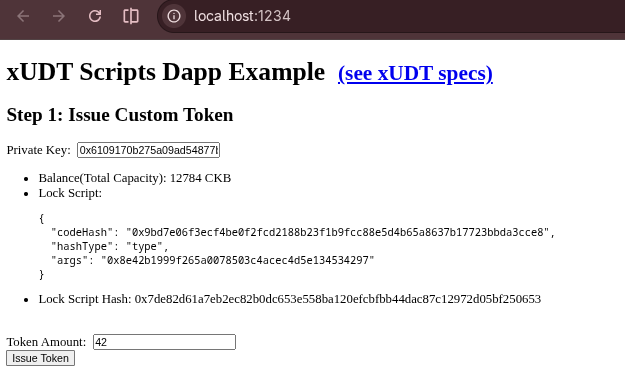
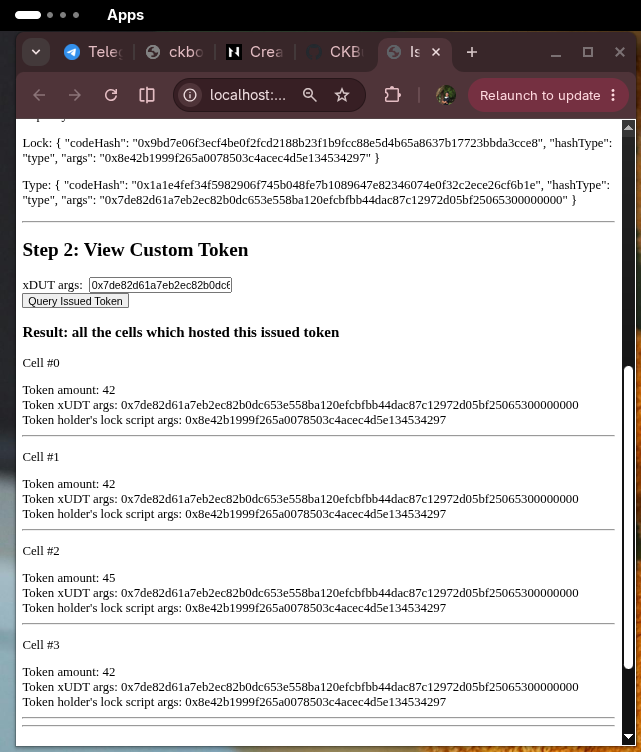
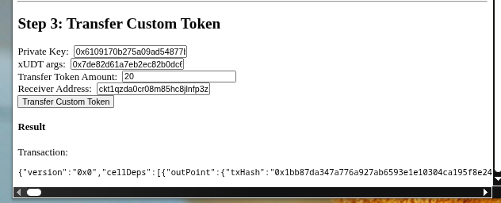
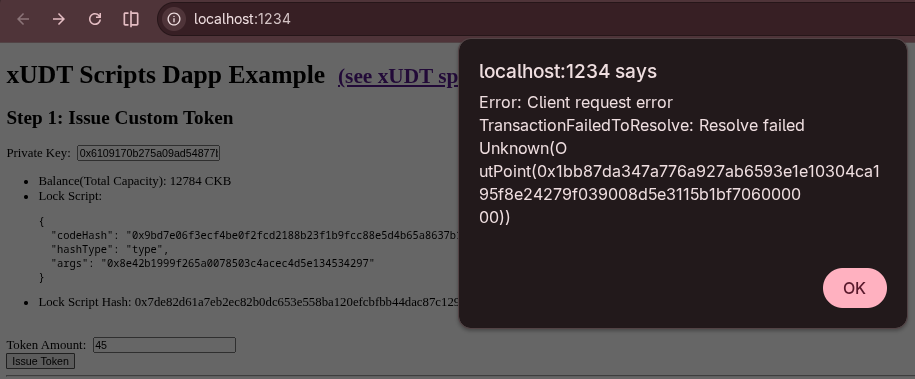
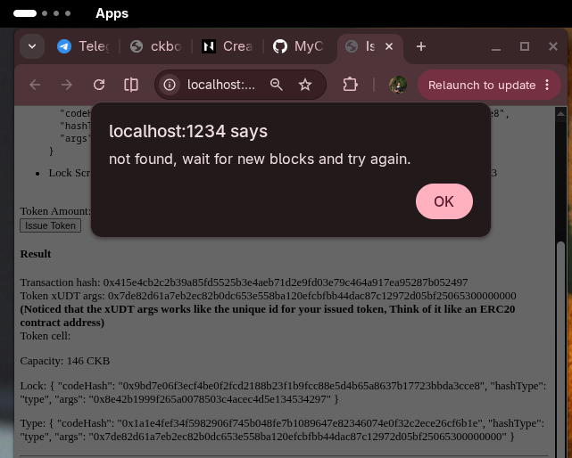
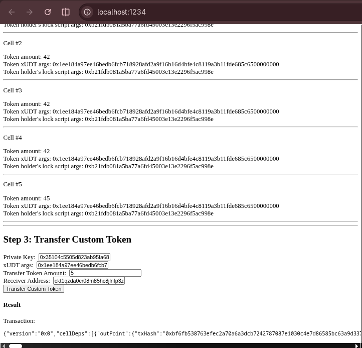
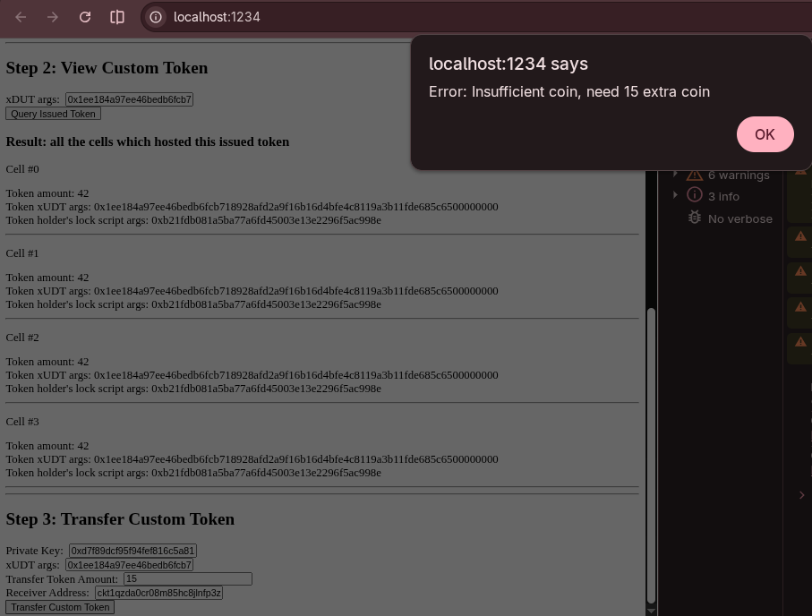

# Create A Fungible Token

**Name**: Teresia Mkarie<br>
**Date**: 18th-September-2026<br>

# Extensible UDT
xUDT (Extensible User-Defined Token) is a token standard for creating and managing fungible tokens.It is the equivalent of ERC-20 on Ethereum but has more flexibility.It is an extension of Simple UDT for
defining more behaviors a UDT might need. While simple UDT provides a minimal
core for issuing UDTs on Nervos CKB, extensible UDT builds on top of simple UDT
for more potential needs, such as regulations.Referrenced from: **[xUDT](https://docs.nervos.org/docs/assets-token-standards/xudt)**:


## Tasks Completed
- set up and ran `docs.nervos.org/examples/dApp/xudt` hereby testing the following:
  - **[Issuing Custom Token](https://docs.nervos.org/docs/dapp/create-token)**:The issuing of custom tokens is facilitated by the `IssueToken` function in the `lib.ts` which takes two parameters: the **`privkey`** and the **`amount`**.<br>

  - **[viewing custom token](https://docs.nervos.org/docs/dapp/create-token#token-info--holders)**: Having issued the `custom token`,the next step was checking out the token and viewing its holders.This will be facilitated by the `queryIssuedTokenCells` function in the `lib.ts` file.To query a custom token Cell, we must know its xUDTArgs which I obtained after issuing the Custom token.<br>
  - **[Transfer Custom token](https://docs.nervos.org/docs/dapp/create-token#transfer-custom-token)**: Next was sending some tokens to someone else.I replaced the Lock Script of the custom token Cell with the receiver's Lock Script. This made the transfer of the token from one to other people.<br>

## Issues
### Issues1: Devnet Not Fully Started
Discovered that the devnet was not started as i tried to issue the tokens,thus querying and viewing of the Issued token could not be ran.Fixed it by re-starting my devnet using the `offckb node` to run the Dapp.<br>

### Issue2: Token Capacity Issue
I came across such an error having changed the default token amount from 42 to 45 which could not allow me to issue a token neither query or view the customed token.From the `index.tsx` file the code was by default set to 42 as the amount,so i returned 42 to allow the issuing of the token.
```typescript
  // default token amount: 42
  const [amount, setAmount] = useState('42'); 
```
<br>

## Deployment to Testnet
Generated an address after refrencing from [Generate Address for Testnet](https://docs.nervos.org/docs/ckb-fundamentals/ckb-address) deployment funded the address by obtaining Testnet faucets from  **[Faucets](https://faucet.nervos.org/)** .I changed the private key i was using for devnet inside  the **index.tsx** file to the private key matching the address funded for testnet; which later reflected as the private key after running the app.<br>

### Issues During Testnet Deployment
I tried transfering tokens to another account address in `Testnet network` but each time ran with an error of insufficient coin.Had to refrence from the `ckb-explorer` to check if the xUDT transaction took place.**[CKB-Explorer](https://explorer.nervos.org/)**<br>


## KeyLearnings
Extensible UDT(xUDT) is the User-Defined-Token(fungible token) Script implementation on CKB.When issuing tokens,most developers use xUDT as the Script.An xUDT Cell Data Structure takes a backward compatible with Simple UDT,built on top of the `sUDT`.Its Data Structure has mainly 3 values `data`, `type` and `lock` as follows:
```yaml
data:
  <amount: uint128> <xUDT data>
type:
  code_hash: xUDT type script
  args: <owner lock script hash> <xUDT args>
lock: <user_defined>
```
The **`amount`** is a 128-bit unsigned integer in little endian format.The `xUDT Args` takes the following structure:
```yaml
<4-byte xUDT flags> <Variable length bytes, extension data>
```
 
 ### Extensible UDT(xUDT) Use Cases
 xUDT is ideal for scenarios where tokens require on-chain programmable behavior or governance logic that sUDT cannot provide. An xUDT can be useful in:<br>
    - Enforces a Maximum Token Supply<br>
    - Restricts Token Transfers by Time<br>
    - Efficient For Exchange Account Representation<br>
    - Programmatic Token Minting via Script Logic

