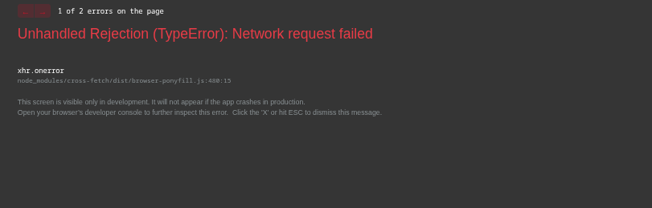
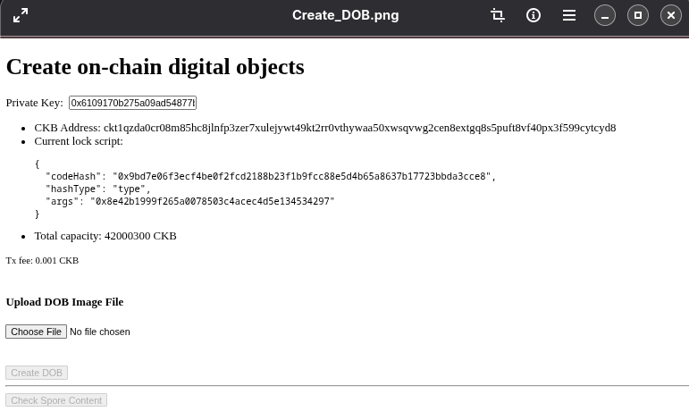
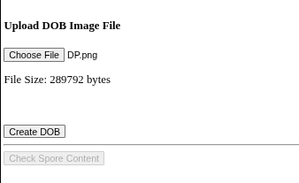
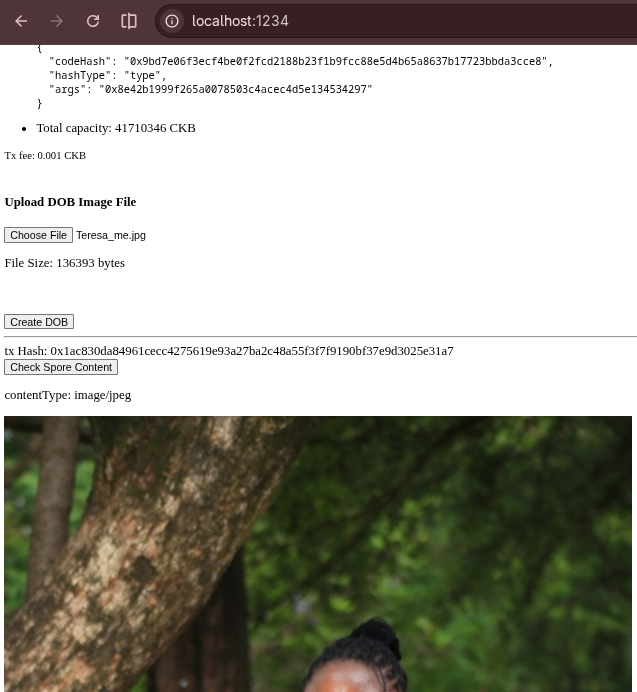
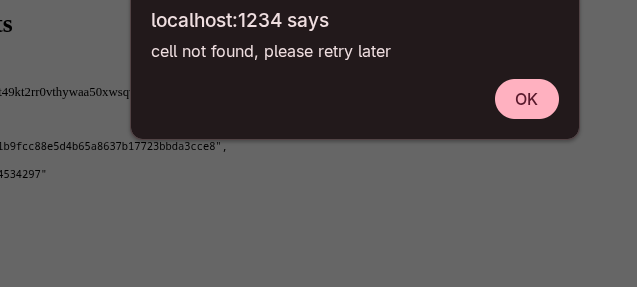
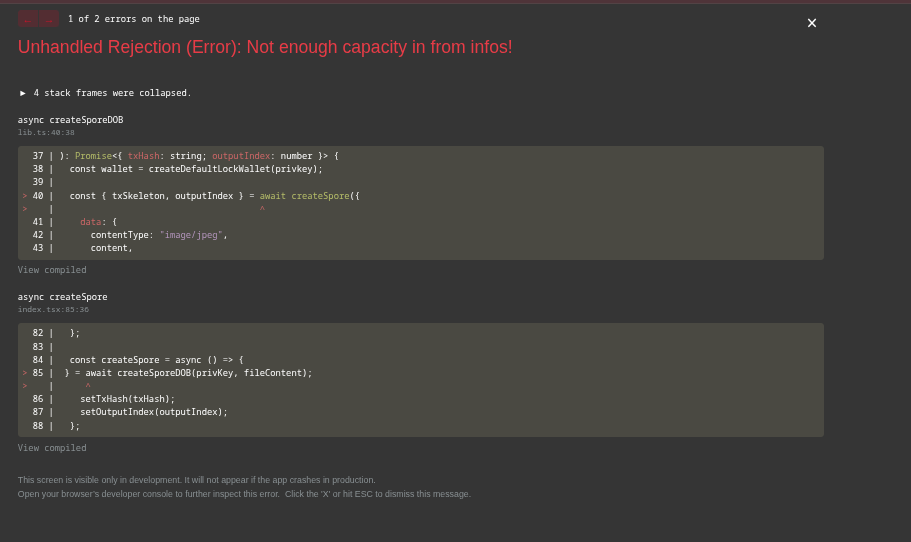
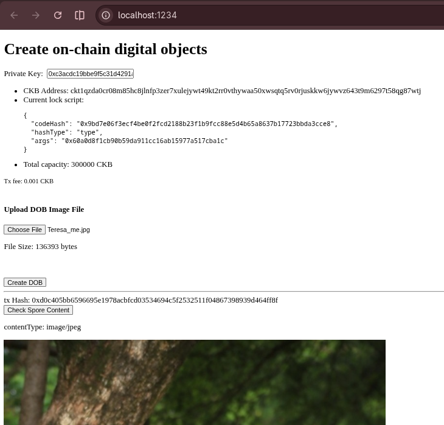

# Create a Digital Object Using Spore Protocol

**NAME**: Teresia Mkarie 
**DATE**: 24th-August-2026 

## Tasks Completed
- **[Create a Digital Object Using Spore Protocol](https://docs.nervos.org/docs/dapp/create-dob#create-digital-object)**: Completed the practical tutorial for building a simple dApp that converts local image files into Spore output cells using the Spore SDK and CCC transaction builders.I also explored the Spore protocol architecture, focusing on how CKB enables fully on-chain digital objects (DOBs) compared to traditional off-chain ERC-721 NFTs.  
- **[Render the Content from the Digital Object](https://docs.nervos.org/docs/dapp/create-dob#render-content-from-digital-object)**:Having created the Digital object on-chain;I learnt that to render and show the image on the browser,one  needs to first find the spore cell of the digital object,extract the data from the *Spore Cell* and then decode its data content. 
- **Deploy to Testnet**:  I changed the **NETWORK** environment variable to **testnet** for the testnet deployment of the dApp.

## Issues During Building
To Interact with the **dApp** for the *Create-digital-object* i came accross this error. This was after i tried uploading an image on-chain.

### How I managed to fix this Issue
Apparently the building of the dApp was successful running on *localhost://1234* but my Devnet was not running so it could not register the image uploaded.Fixed it by re-starting the Devnet with the **`offckb node`** command.

## Deployment of the on-chain Digital Object through Spore-SDK
After building and running the dApp,this was the results running locally on host:1234

## Key Findings.
The Create Digital Object accepted two parameters which were visible from the dApp running;**the private key  used to sign and create the digital object** and the **Content to be stored in the Digital object**  - **Before Image Upload**-The Create DOB button is inactive meaning no **on-chain asset** was encoded on the blockchain. - **After Image Upload**- The file size will be indicated and the  fil-type.THis is in line with the content-type and content of the data fields of the **SporeCell.** From the **SporeCell** which has a data structure consisting of 3-main fields,the **data field**,**type field** and the **lock field**,The data field which contains the content-type and the content will allow the user to transform any content uploaded to digital object whichis fully stored on-chain. 
## Render the Image in the Browser
 With the **Spore Cell** of the digital object and after decoding its content the image gets to be rendered in the browser as shown.The **cccClient.getCellLive** will enable the getting of the **liveCell** of the digital object decoded to be rendered.If the cell is null, it returns the following alert message  

## Deploying the app to Testnet
### Testnet error
Switched to the testnet **NETWORK** and came across this error when i tried to create the Digital Object after i had uploaded an mage locally. I realised this was caused by insufficient faucets and i had to fund my testnet address for a successful encoding of the image before being stored on-chain.
Generated an address after refrencing from [Generate Address for Testnet](https://docs.nervos.org/docs/ckb-fundamentals/ckb-address) deployment funded the address by obtaining Testnet faucets from  **[Faucets](https://faucet.nervos.org/)** .I changed the private key i was using for devnet inside  the **index.tsx** file to the private key matching the address funded for testnet; which later reflected as the private key after running the app. 

### Testnet successful Run
This was the successful run on **testnet** after having a private key for a funded address.The faucets to **Create the DOB** onchain after the image upload was way alot,it wanted me to fund it more than 100,000 tesnet faucets before the **tx hash** for the **Create DOB** was established and stored on-chain. 

## Key Learnings
1. **Spore**: an on-chain digital-object(DOB) protocol backed by the CKB that enables secure, efficient, and flexible creation and transfer of digital objects. Its use cases are mainly:
 - Non-fungible Tokens (NFTs)
 - Digital collectibles
 - Gaming assets
 -  Redeemable digital vouchers or certificates
 2. **Intrinsic Value & Redemption**:Every Spore is backed by locked CKB. This provides a guaranteed minimum floor value. Unlike EVM burning, "melting" a Spore destroys the object but returns the exact locked CKB to the creator.Redemption of Intrinsic value ensures the melting back of spores to the underlying CKBytes achieved by **meltsSpore** API that is provided by the **spore-sdk**.
 - **[Spore-SDK](https://github.com/sporeprotocol/spore-sdk)**- Is the Software development kit used to interact with the Spore protocol specifically designed for seamless integration with Spore, an on-chain asset protocol to power digital asset ownership, distribution, and value capture.
3. **Fully On-Chain Storage**: Spore content (images, JSON, Lua scripts) and MIME types are stored directly in the cell's data field using Molecule serialization, completely eliminating reliance on IPFS or external servers.
4. **Zero-Fee Transfers**: Because the Spore cell carries its own state rent (capacity), it is self-funded. Users do not need CKB to receive a Spore.
5. **Supports Mutliple Content Types**: The Spore protocol suports a wide range of digital content formats(images like JPEGs) enabling flexibility for developers to store diverse media types and data directly on-chain.

